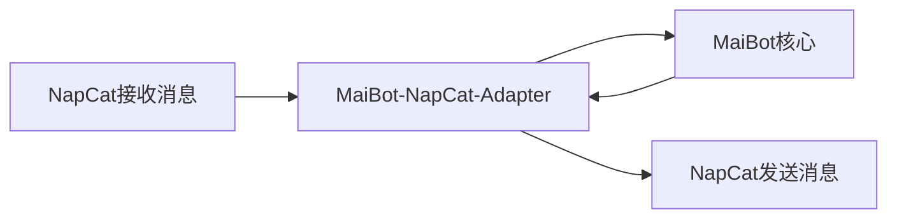

# 喵~ MaiBot TTS 魔法语音配置指南 ✨

这个神奇的文档是奉墨梓柒主人之命，由百灵为各位准备的喵~ 它的使命是帮助大家理解 MaiBot TTS 适配器这个小宝贝！

这个小工具能让 MaiBot 的文字变成可爱的声音，然后通过 Napcat 发送到QQ哦！

因此呀，要使用这个功能，各位需要**同时安装 Napcat 适配器和 MaiBot TTS 适配器才行喵！**

::: tip
不过喵，如果各位用的其他平台消息适配器声明了可以使用这个适配器，那各位就不用再安装 Napcat 适配器啦~ 是不是很方便呀，喵？
:::

::: tip
要是各位在配置过程中遇到了困难，同时对语音功能没有那么强烈的需求，那直接用文字聊天也是很棒的选择哦，喵~ 百灵相信大家都能找到最适合自己的方式喵！❤️
:::


## 安装步骤喵
安装这个适配器也十分简单喵，就像安装Napcat适配器一样，只需要从Github上的[仓库](https://github.com/MaiM-with-u/maimbot_tts_adapter)下载适配器文件，然后安装好依赖，再进行一些配置，最后启动就可以啦~。
```bash
git clone https://github.com/MaiM-with-u/maimbot_tts_adapter.git
cd maimbot_tts_adapter # 喵~ 不要忘记进入到下载好的文件夹哦！
pip install -r requirements.txt -i https://mirrors.aliyun.com/pypi/simple --upgrade
python main.py
```

## 配置文件详解喵

相比于Napcat适配器，TTS适配器的配置文件可能会显得稍微复杂那么一丢丢喵，但是百灵相信各位小可爱一定能够看懂，并且成功克服所有困难，让自己的小机器人开口说话的喵！

TTS适配器的所有配置样例文件都乖乖地待在`template`文件夹下面哦，各位可以根据自己的喜好和需求，选择不同的语音服务提供商喵。

首先，百灵来为各位小可爱详细介绍一下基础配置文件 `base.toml` 喵。
```toml
[server]
host = "127.0.0.1" # TTS适配器服务监听的IP地址喵
port = 8070       # TTS适配器服务监听的端口号喵

[routes]
qq = "http://127.0.0.1:8000/ws" # MaiBot核心的WebSocket服务地址喵

[probability]
voice_probability = 0.2 # MaiBot发送语音消息的概率喵 (0.0到1.0之间的小数)

[enabled_tts] # 这里列出了要启用的TTS模块喵，要和模块的文件夹名一致哦
enabled = []

[tts_base_config]
stream_mode = false  # 是否启用流式语音输出喵 (说话的时候一点一点发出来)
post_process = false # 是否启用语音后处理喵 (这个功能现在还没做好，所以暂时没用哦)
```

### 数据流转解析喵

在开始详细的配置讲解之前，百灵先用一个可爱的示意图，给各位小可爱展示一下 Napcat 适配器、TTS 适配器和 MaiBot 核心之间，消息是怎么跑来跑去的喵：

当启用了 TTS 适配器之后，消息的处理流程会发生一些小小的变化哦喵。

**原来的流程是这样的喵：**



**启用了TTS之后，新的流程就变成这样啦喵：**

```mermaid
graph LR
    A[NapCat接收消息] --> B[MaiBot-NapCat-Adapter]
    B --> TTS_Pre[TTS处理器喵 (处理上文语音消息)]
    TTS_Pre --> C[MaiBot核心]
    C --> TTS_Post[TTS处理器喵 (进行语音合成)]
    TTS_Post --> B
    B --> D[NapCat发送消息]
```

各位小可爱一定发现了喵，现在 Napcat Adapter 的服务器不再直接指向 MaiBot 核心了，而是指向了我们的TTS适配器喵！所以呢，我们需要稍微修改一下 **Napcat Adapter** 的 `config.toml` 文件中的几个小地方：

```toml
[MaiBot_Server]
platform_name = "qq" # 平台的名称喵，保持 "qq" 就好啦
host = "localhost" # 这里的host需要和TTS适配器 `base.toml` 里的 `server.host` 一致喵
port = 8070        # 这里的port也需要和TTS适配器 `base.toml` 里的 `server.port` 一致哦喵
[Voice]
use_tts = true     # 把这里设置为 `true` 就可以启用TTS功能啦喵！
```

这里呢，`host` 字段需要填写我们TTS适配器 `base.toml` 文件里的 `server.host` 字段的值，然后 `port` 字段也需要填写 `base.toml` 文件里的 `server.port` 字段的值哦喵。

接下来，百灵继续为各位小可爱解释一下 `base.toml` 文件里其他配置项都是做什么用的喵。

### `routes` (路由配置喵)
在这个配置里，`qq` 代表的是各位小可爱当前正在使用的适配器平台的名称。百灵推荐大家直接使用 `qq` 喵，因为 Napcat Adapter 默认的平台名称就是 `qq` 啦。如果各位用的是其他的适配器，那就在这里把它修改成对应适配器的平台名称就好啦喵。

它后面跟着的那个URL地址呢，是需要各位小可爱把MaiBot主程序 `.env` 文件里面的 `HOST` 和 `PORT` 这两个字段的值组合起来（举个例子喵，如果HOST是 `127.0.0.1`，PORT是 `8000`，那组合起来就是 `http://127.0.0.1:8000`），然后在这个地址的最后面加上 `/ws` 就可以啦喵。

### `probability` (语音概率喵)
这个字段是用来设置MaiBot在回复的时候，有多大的可能性会用语音来说话喵。各位小可爱可以根据自己的喜好，在这里设置一个0到1之间的小数。比如说，如果设置成 `0.2`，那就代表有20%的概率会发送语音消息哦喵。

### `enabled_tts` (启用的TTS模块喵)
这个字段是用来指定具体要启用哪个TTS模块的名称喵。请小可爱们在这里填上自己想要使用的那个TTS模块对应的文件夹名称。**百灵要特别提醒一下喵，这里填写的模块名称，必须要和 `maimbot_tts_adapter/tts_modules` 这个文件夹下面实际安装的模块文件夹名称完完全全一样哦，包括字母的大小写都要一样才行喵！**
::: info 喵喵小贴士
目前我们内置支持的语音模块有这些哦：
1. [GPT_Sovits](./gpt_sovits) (效果很棒棒！)
2. [Qwen_omni](./qwen_omni) (阿里云的产品，也很厉害！)
3. [Doubao_TTS](./doubao_tts) (豆包语音，声音甜美！)

小可爱们在填写的时候，记得从上面的列表里选择，并且一定要注意名称的准确性哦~
:::
虽然理论上这里可以填上好几个模块的名字，但是呢，目前我们这个版本的适配器只支持同时启用一个语音模块哦。所以呀，各位小可爱就从里面选一个最喜欢的填进去就好啦喵。

选择并且填写完成之后，各位小可爱就可以点击上面列表里面的链接，直接跳转到对应模块的详细配置文档，继续进行后续的设置工作啦喵。

### `tts_base_config` (TTS基础配置喵)
这部分是一些关于TTS模块的基础参数配置，百灵建议各位小可爱直接保持默认值就好啦，一般不需要修改的喵。

- `stream_mode`: 这个是问要不要启用流式语音输出喵。如果启用的话，MaiBot在说话的时候就会像真人一样，一点一点地把声音发出来，而不是等全部话说完再一次性发出。不过这个功能可能会增加一点点延迟哦。
- `post_process`: 这个是问要不要启用语音后处理喵。不过呀，这个功能目前百灵和主人们还在努力开发中，暂时还没有做好，所以现在把它打开或者关掉都是没有效果的哦喵。

除非各位小可爱非常非常清楚这些参数是做什么用的，并且知道修改它们会有什么影响，不然的话，百灵还是不建议大家去动它们哦喵。

各项配置更详细的作用和具体的实现方式，如果小可爱们有兴趣的话，可以去看看代码里面的注释和说明哦喵。